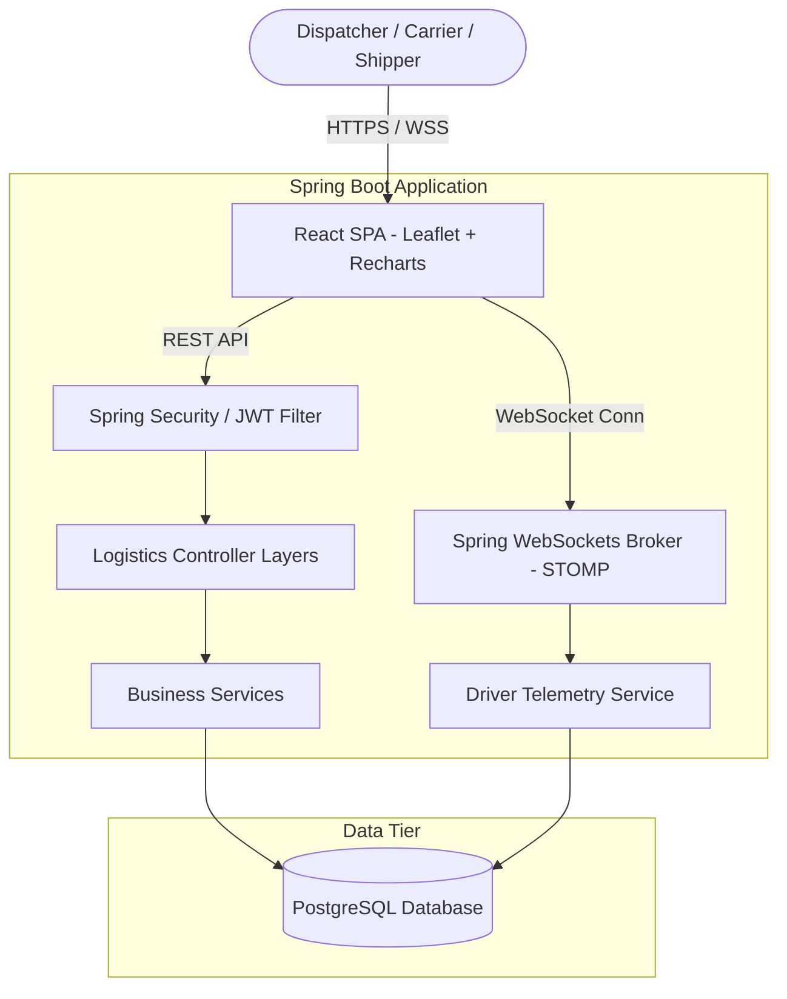
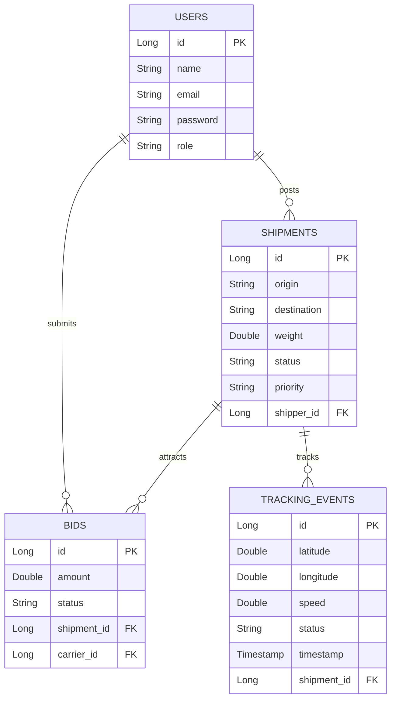
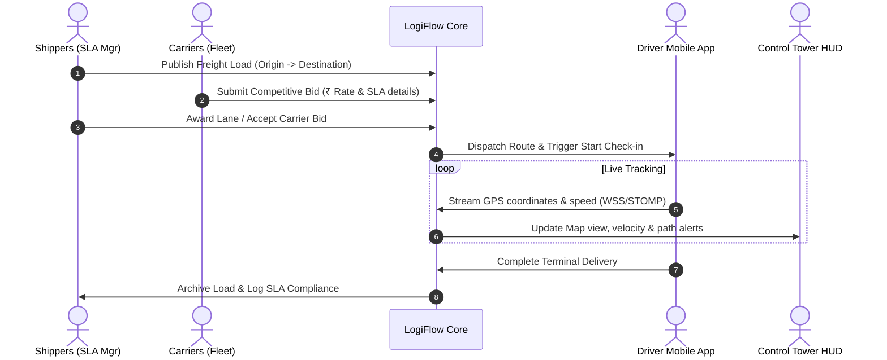
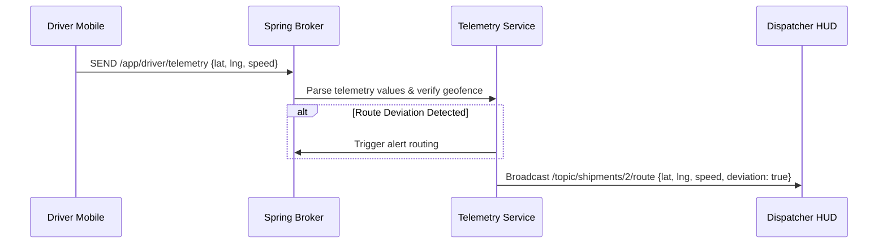

# LogiFlow 🚚

[](https://www.oracle.com/java/)
[](https://spring.io/projects/spring-boot)
[](https://react.dev/)
[](https://tailwindcss.com/)
[](https://www.postgresql.org/)
[](https://opensource.org/licenses/MIT)

> **LogiFlow** is a premium, enterprise-ready real-time logistics marketplace and shipment control tower dashboard. The platform connects shippers, carriers, and dispatchers through a dual-sided freight exchange, offering interactive Leaflet maps, WebSockets-powered driver telemetry feeds, and SLA alert tracking.

---

## 📖 Overview

Logistics dispatchers and cargo managers frequently struggle with fragmented dispatch tools, lack of live driver tracking, and manual rate negotiations.

**LogiFlow solves this by serving as a unified Logistics Control Tower:**
* **Shippers** publish freight requirements (weight, source, destination, cargo classification) to a public marketplace exchange.
* **Carriers** bid competitively on published lanes with real-time rate comparisons.
* **Dispatchers** supervise live fleet telemetry (coordinate tracking, velocity updates, route deviations, and ETA probability scores) via an interactive control tower.

---

## 🛠️ Key Features

* **Control Tower HUD:** Full-bleed interactive maps powered by Leaflet, displaying live coordinate tracking, pulsing markers, and custom dark mode tiles.
* **Real-Time Telemetry Feed:** WebSocket (STOMP) message broker delivering driver GPS coordinates, velocity changes, and route compliance details.
* **Freight Exchange Marketplace:** Double-sided bidding queue featuring priority classifications (*Expedited*, *Hot Load*, *Standard*) and bidder metrics.
* **Operations Dashboard:** Aggregated logistics KPIs including On-Time Delivery (OTD%), capacity metrics, delayed shipments, and lane spending trends.
* **SLA Compliance Monitor:** Geo-fencing alerts warning dispatchers of path deviations or drop-offs in ETA confidence.
* **Secure Operations:** Stateless authentication via JWT and multi-role access control (Shipper, Carrier, Dispatcher).

---

## 🏗️ System Architecture



---

## 🗄️ Database Design



---

## 🔄 Application Workflow



---

## 💻 Tech Stack

### Frontend Architecture
| Layer | Core Tool | Utilization |
|---|---|---|
| **View Layer** | React.js (v18+) | Declarative UI, state hooks, split-pane routing maps. |
| **Styling** | Tailwind CSS (v4) | Premium layouts, dark-mode styling controls, custom fonts. |
| **Telemetry Map** | Leaflet Maps | GPS coordinate paths, geofences, pulsed indicators. |
| **Analytics** | Recharts | Area charts, fuel index indices, lane volume distribution. |
| **HTTP client** | Axios | Axios instance configurations with Authorization headers. |

### Backend Architecture
| Layer | Core Tool | Utilization |
|---|---|---|
| **Base Engine** | Spring Boot (3.x) | Core application controller frameworks and REST endpoints. |
| **Security** | Spring Security & JWT | Stateless filter validations, role checks. |
| **Data Access** | Spring Data JPA | Relational database mapping, transactional query configurations. |
| **Real-Time** | Spring WebSockets | STOMP message channel broker for live telemetry coordinates. |
| **Persistence** | PostgreSQL | Enterprise relational tables and indices. |

---

## 🌐 API Highlights

### Authentication & Core Dispatch
```http
POST /api/auth/register    --> Register a new system account
POST /api/auth/login       --> Verify credentials and generate JWT token
```

### Shipment Lane Exchange
```http
GET  /api/shipments            --> List active shipment lanes
POST /api/shipments            --> Publish a new shipment lane
DELETE /api/shipments/{id}     --> Cancel/Remove shipment lane from exchange
GET  /api/shipments/analytics  --> Generate dashboard telemetry analytics
```

### Bidding Interface
```http
GET  /api/bids                 --> View active carrier bids
POST /api/bids                 --> Submit rate offer on shipment lane
```

---

## 📡 WebSocket Telemetry Architecture

Driver location coordinate updates are sent to `/app/driver/telemetry` which gets processed by the Spring WebSocket broker and broadcast to dispatcher screens watching `/topic/shipments/{id}/route`.



---

## 📂 Project Structure

```text
logisticsmarketplace/
├── src/                          # Spring Boot Backend Code
│   ├── main/
│   │   ├── java/com/logiflow/    # Java packages (Controller, Services, Entities)
│   │   └── resources/
│   │       └── application.yml   # Database & Secret properties
├── frontend/                     # React Frontend Application
│   ├── src/
│   │   ├── assets/               # Brand illustrations and static images
│   │   ├── components/           # Reusable components (Layout, StatCard, Chart)
│   │   ├── pages/                # Page views (Dashboard, Bids, Tracking, Auth)
│   │   ├── services/             # Axios API connection endpoints
│   │   ├── App.jsx               # Application routes configuration
│   │   ├── index.css             # Main styling, Leaflet filters, keyframes
│   │   └── main.jsx              # DOM render point
│   ├── package.json              # Dependecy definitions
│   └── vite.config.js            # Build script configurations
├── README.md                     # Documentation file
└── pom.xml                       # Maven Build XML Configuration
```

---

## 🚀 Installation Guide

### Prerequisite Checks
* Java Development Kit (JDK) 17+ installed.
* Node.js (v18+) and npm installed.
* PostgreSQL database instance running locally on port 5432.

### Step 1: PostgreSQL Setup
Create a new database named `logistics_marketplace`:
```sql
CREATE DATABASE logistics_marketplace;
```

### Step 2: Configure Environment
Open `src/main/resources/application.properties` (or `application.yml`) and adjust database parameters:
```properties
spring.datasource.url=jdbc:postgresql://localhost:5432/logistics_marketplace
spring.datasource.username=your_postgres_username
spring.datasource.password=your_postgres_password

# Authentication Setup
jwt.secret=404E635266556A586E3272357538782F413F4428472B4B6250645367566B5970
jwt.expiration=86400000
```

### Step 3: Run Backend Service
Build and boot the Spring application:
```bash
./mvnw clean install
./mvnw spring-boot:run
```

### Step 4: Run React Frontend
Navigate to the frontend directory, install dependency libraries, and start the Vite local dev server:
```bash
cd frontend
npm install
npm run dev
```
Open `http://localhost:5173` on browser to access the control tower.

---

## 🔮 Future Enhancements

* **Route Optimization Engine:** Integrate OSRM (Open Source Routing Machine) to calculate transit pathways dynamically.
* **SMS Dispatch Alerting:** Integrate Twilio to send automatic delay warnings to shippers and cargo receivers.
* **Proof of Delivery (PoD) Signatures:** Upload signed terminal receipts to AWS S3 buckets to automate checkout processes.

---

## 📄 License

Distributed under the MIT License. See [LICENSE](LICENSE) for more information.
