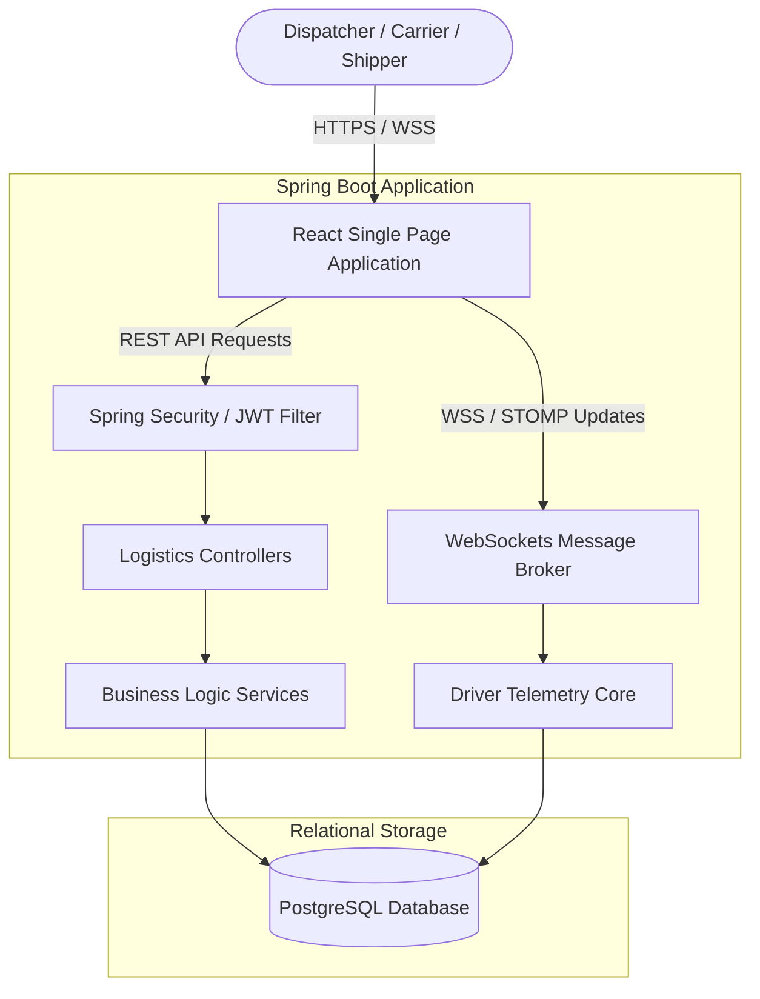
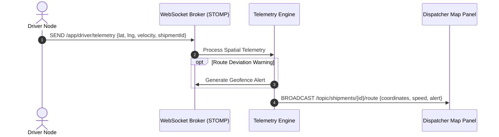
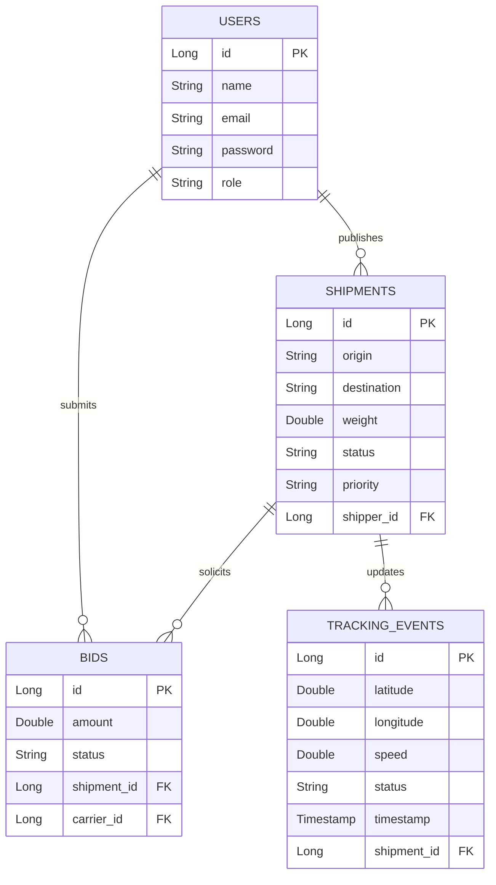
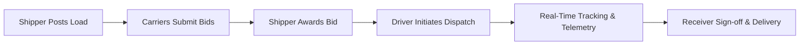
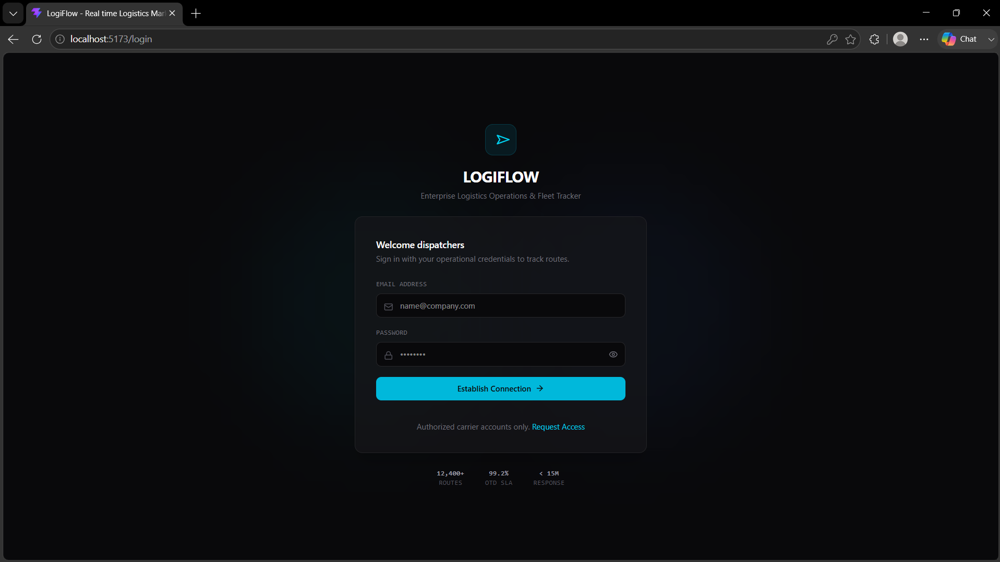
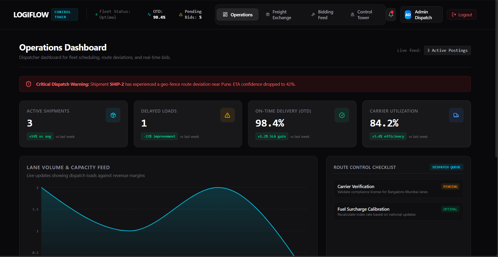
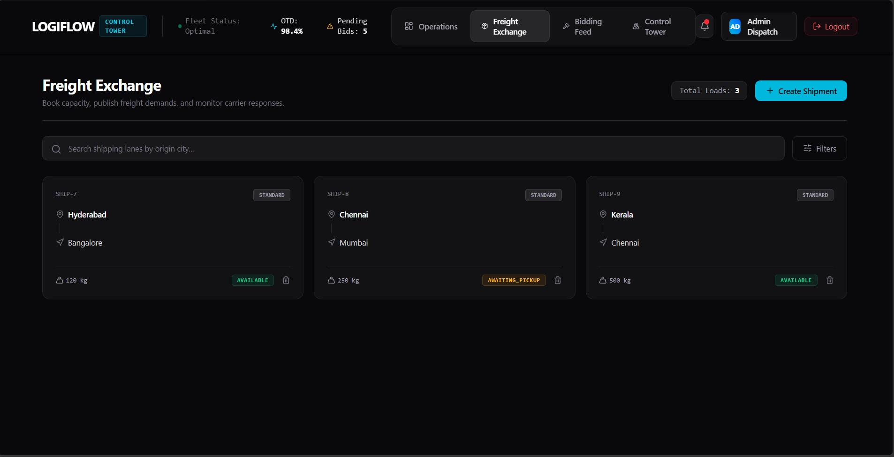
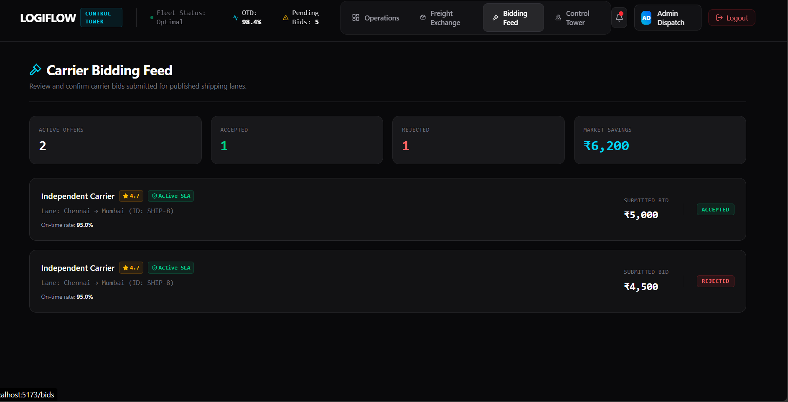
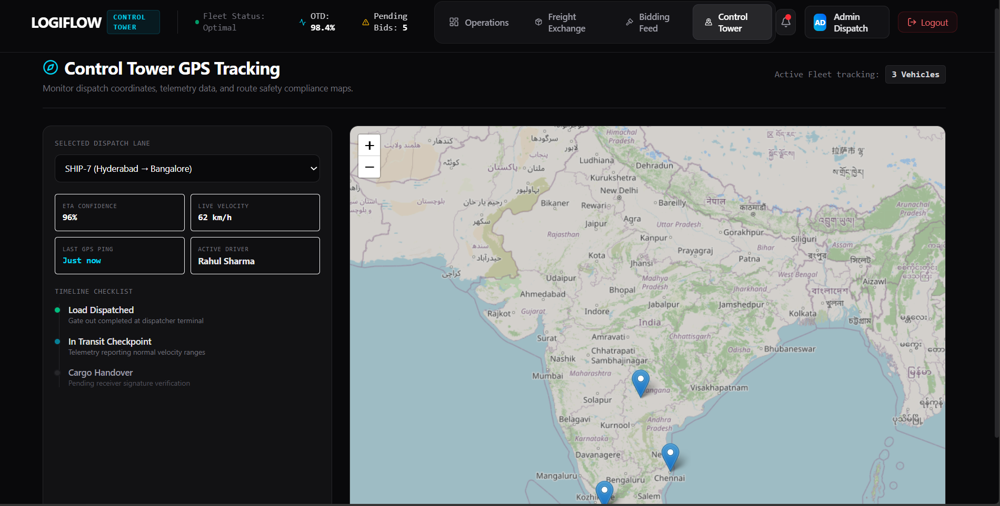

# LogiFlow — Real-Time Shipment Tracking Portal & Logistics Marketplace

[](https://www.oracle.com/java/)
[](https://spring.io/projects/spring-boot)
[](https://react.dev/)
[](https://tailwindcss.com/)
[](https://www.postgresql.org/)
[](https://opensource.org/licenses/MIT)

---

## 📌 Table of Contents

1. [Executive Summary](#-executive-summary)
2. [Project Highlights](#-project-highlights)
3. [System Architecture](#-system-architecture)
4. [Real-Time Tracking Architecture](#-real-time-tracking-architecture)
5. [Database Architecture](#-database-architecture)
6. [Project Workflow](#-project-workflow)
7. [Security Features](#-security-features)
8. [Folder Structure](#-folder-structure)
9. [API Documentation](#-api-documentation)
10. [Engineering Concepts Demonstrated](#-engineering-concepts-demonstrated)
11. [Project Metrics](#-project-metrics)
12. [Installation & Deployment](#-installation--deployment)
13. [Screenshots Section](#-screenshots-section)
14. [Learning Outcomes](#-learning-outcomes)
15. [Why This Project Stands Out](#-why-this-project-stands-out)
16. [Author & License](#-author--license)

---

## 💼 Executive Summary

LogiFlow is a dual-sided logistics marketplace and real-time shipment control portal engineered to resolve fleet asset management friction and load pricing fragmentation. Developed using **Spring Boot**, **React.js**, and **PostgreSQL**, the platform allows shippers to post freight loads, carriers to submit competitive bids, and dispatchers to track vehicle coordinate paths in real-time through WebSocket-based telemetry feeds and interactive dark-themed maps.

---

## 🚀 Project Highlights

| Feature | Operational Benefit | Core Technology |
| :--- | :--- | :--- |
| **Control Tower HUD** | Consolidated map interface tracing coordinate paths and fleet telemetry. | Leaflet Maps & CSS Filters |
| **Real-Time GPS Sync** | Zero-latency delivery tracking updates broadcast directly to dispatch panels. | Spring WebSockets & STOMP |
| **Competitive Bidding** | Lower lane transportation costs through carrier pricing models. | Relational DB Indexing |
| **Route Deviations** | Proactive warning alarms when vehicle GPS paths wander off calculated paths. | Geofencing Verification |
| **On-Time Analytics** | Clear graphical metrics tracking carrier performance against SLAs. | Recharts Area Gradients |

---

## 🏗️ System Architecture



---

## 📡 Real-Time Tracking Architecture

LogiFlow streams spatial coordinates from driver dispatch nodes to dispatch panels using a lightweight STOMP messaging pipeline over TCP connection lines.



> [!NOTE]
> Standard map tiles are modified using custom CSS inversion filters (`.dark-map .leaflet-tile-container`) to provide a premium, low-glare visual theme matching Stripe and Flexport styling standards.

---

## 🗄️ Database Architecture

LogiFlow stores transactional operations in an optimized PostgreSQL database.



---

## 🔄 Project Workflow



---

## 🔒 Security Features

* **JWT Stateless Authentication:** Tokens are generated upon valid credential logins and verified in standard filter chains.
* **Role-Based Access Control (RBAC):** Restricts endpoints and UI actions depending on user clearances (*Shipper*, *Carrier*, *Dispatcher*).
* **Password Encryption:** User passwords are encrypted using BCrypt standard methods before storing in relational databases.
* **React Route Guards:** Restricts layout components, redirecting unauthenticated sessions to the secure access page.

---

## 📂 Folder Structure

```text
logisticsmarketplace/
├── src/                          # Java Spring Boot Backend Engine
│   ├── main/
│   │   ├── java/com/logiflow/    # Core packages (Controller, Services, Entity, Security)
│   │   └── resources/
│   │       └── application.properties # Database connection & JWT secrets
├── frontend/                     # React Frontend SPA
│   ├── src/
│   │   ├── components/           # UI Blocks (Layout, StatCard, AnalyticsChart)
│   │   ├── pages/                # App Views (Dashboard, Shipments, Bids, Tracking, Auth)
│   │   ├── services/             # Axios API connections
│   │   ├── index.css             # Styles, Leaflet filters, animations
│   │   └── App.jsx               # Routes and access guards
│   ├── package.json              # Javascript configuration
│   └── vite.config.js            # Build profiles
├── pom.xml                       # Maven Dependency Management
└── README.md                     # Documentation file
```

---

## 📋 API Documentation

### Access and Security
| Verb | Endpoint | Authentication | Goal |
| :--- | :--- | :--- | :--- |
| `POST` | `/api/auth/register` | Open | Create new platform operator profile. |
| `POST` | `/api/auth/login` | Open | Verify credentials and return active JWT token. |

### Freight Lane Exchange
| Verb | Endpoint | Authentication | Goal |
| :--- | :--- | :--- | :--- |
| `GET` | `/api/shipments` | JWT Required | Retrieve current active shipping lanes. |
| `POST` | `/api/shipments` | JWT + Shipper | Publish new freight lane parameters. |
| `DELETE` | `/api/shipments/{id}` | JWT + Shipper | Remove shipping lane posting from exchange. |
| `GET` | `/api/shipments/analytics` | JWT Required | Generate capacity analytics. |

### Bidding Deck
| Verb | Endpoint | Authentication | Goal |
| :--- | :--- | :--- | :--- |
| `GET` | `/api/bids` | JWT Required | Review active carrier offers. |
| `POST` | `/api/bids` | JWT + Carrier | Submit rate pricing for active lane postings. |

---

## 🧠 Engineering Concepts Demonstrated

* **Stateless Token Management:** Designing filters validating cryptographic signatures.
* **Relational Normalization:** Mapping entity relationships to prevent database redundancies.
* **Event Broker Management:** Configuring message mappings and channels using STOMP protocols.
* **Single Page Navigation:** Rendering path changes smoothly using React Router properties.
* **UI Telemetry Filters:** Applying real-time visual modifications on map tiles.

---

## 📊 Project Metrics

* **Core User Roles:** 3 Roles (Shipper, Carrier, Dispatcher)
* **Real-Time Data Pipelines:** WebSockets STOMP over TCP
* **Visual Telemetry Components:** Leaflet Interactive Maps
* **Database Entities:** 4 Entities (Users, Shipments, Bids, Tracking Events)
* **REST Endpoints Exposed:** 8 active paths

---

## 🔧 Installation & Deployment

### Prerequisite Checklist
* JDK 17+ installed.
* Node.js (v18+) and npm installed.
* Running PostgreSQL database instance (default Port 5432).

### Database Initialization
Create database in PostgreSQL console:
```sql
CREATE DATABASE logistics_marketplace;
```

### Backend Build Configurations
Set environment profiles in `src/main/resources/application.properties`:
```properties
spring.datasource.url=jdbc:postgresql://localhost:5432/logistics_marketplace
spring.datasource.username=postgres_user
spring.datasource.password=postgres_password
jwt.secret=404E635266556A586E3272357538782F413F4428472B4B6250645367566B5970
```
Build and run the Maven project:
```bash
./mvnw clean install
./mvnw spring-boot:run
```

### Frontend Build Configurations
Install packages and start the Vite local server:
```bash
cd frontend
npm install
npm run dev
```
Open `http://localhost:5173` on browser.

---

## 🖼️ Screenshots

> [!TIP]
> The screenshots below showcase LogiFlow's core workflows, including authentication, operations management, freight exchange, carrier bidding, and real-time shipment tracking.

### 🔐 Login Portal



Secure JWT-based authentication portal providing controlled access for dispatchers, shippers, and carriers.

---

### 📊 Operations Dashboard



Centralized operations dashboard displaying active shipments, delayed loads, carrier utilization, SLA metrics, and logistics analytics.

---

### 🚚 Freight Exchange Marketplace



Freight marketplace where shippers publish shipment requirements and manage transportation demand across available carriers.

---

### 💰 Carrier Bidding Feed



Competitive bidding interface enabling carriers to submit transportation proposals while allowing shippers to review, accept, or reject bids.

---

### 📡 Control Tower GPS Tracking



Real-time shipment monitoring dashboard powered by Spring WebSockets, STOMP messaging, and Leaflet Maps for live fleet visibility and route tracking.

---

## 🎓 Learning Outcomes

* **Spring Security Internals:** Configured filter chains and stateless token verifications.
* **Low-Latency Telemetry Channels:** Engineered event coordinate delivery flows using STOMP.
* **Domain Logic Execution:** Modeled load priorities, geofencing deviation logic, and bidding pricing limits.
* **Visual Map Integration:** Combined map containers, custom tiles, and interactive popups in single page displays.

---

## 💎 Why This Project Stands Out

Unlike generic database-driven templates, LogiFlow demonstrates key system design skills:
1. **Low Latency Communications:** Replaces HTTP polling loops with active WebSocket connections.
2. **Operational Dashboards:** Presents visual telemetry maps and KPI summaries tailored to logistics dispatcher workloads.
3. **Structured Normalization:** Implements database schemas separating users, bids, tracking points, and shipments.

---

## 👤 Author & License

* **Author:** M. Sai Sneha Sree
* **License:** Distributed under the MIT License. See `LICENSE` for more information.
